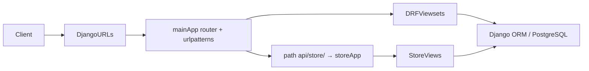

# Architecture — Clinic-Oupharmacy-BE

## Tổng quan

Backend **Django** phục vụ REST API: **mainApp** (clinic, user, examination, thuốc, …) và **storeApp** (API cửa hàng dưới prefix `api/store/`). Entry URL gốc: `OUPharmacyManagementApp/urls.py` → include `mainApp.urls`.

## Luồng request (điển hình)

- **DRF `DefaultRouter`** trong `mainApp/urls.py` đăng ký viewsets (`users`, `medicines`, `examinations`, …).
- **OAuth2 / social:** `oauth2_provider`, `oauth2-info/`, `auth/firebase/`, v.v. (chi tiết trong `mainApp/urls.py`).
- **Store:** `path('api/store/', include('storeApp.urls'))` — tách domain storefront khỏi API clinic core.

## Ranh giới

| Prefix / khu | Gợi ý khi mở rộng |
|--------------|-------------------|
| `/` (root) qua `mainApp` | API nội bộ clinic, user, lịch, đơn thuốc, … |
| `/api/store/` | Logic bán hàng / đơn online — ưu tiên trong `storeApp` |

Cập nhật file này khi thêm app Django mới, đổi mount URL gốc, hoặc tách/hợp store API.
