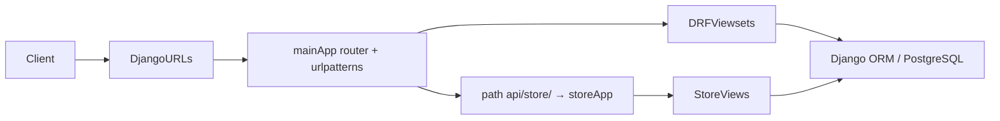

# Architecture — Clinic-Oupharmacy-BE

## Tổng quan

Backend **Django** phục vụ REST API: **mainApp** (clinic, user, examination, thuốc, …) và **storeApp** (API cửa hàng dưới prefix `api/store/`). Entry URL gốc: `OUPharmacyManagementApp/urls.py` → include `mainApp.urls`.

## Luồng request (điển hình)

```mermaid
flowchart LR
  Client --> DjangoURLs
  DjangoURLs --> MainRouter["mainApp router + urlpatterns"]
  MainRouter --> DRFViewsets
  MainRouter --> StoreInclude["path api/store/ → storeApp"]
  StoreInclude --> StoreViews
  DRFViewsets --> ORM["Django ORM / PostgreSQL"]
  StoreViews --> ORM
```

- **DRF `DefaultRouter`** trong `mainApp/urls.py` đăng ký viewsets (`users`, `medicines`, `examinations`, …).
- **OAuth2 / social:** `oauth2_provider`, `oauth2-info/`, `auth/firebase/`, v.v. (chi tiết trong `mainApp/urls.py`).
- **Store:** `path('api/store/', include('storeApp.urls'))` — tách domain storefront khỏi API clinic core.

## Ranh giới

| Prefix / khu             | Gợi ý khi mở rộng                                      |
| ------------------------ | ------------------------------------------------------ |
| `/` (root) qua `mainApp` | API nội bộ clinic, user, lịch, đơn thuốc, …            |
| `/api/store/`            | Logic bán hàng / đơn online — ưu tiên trong `storeApp` |

## Ghi chú cấu trúc `storeApp`

- `storeApp.models` đã tách thành package theo domain để dễ bảo trì:
  - `storeApp/models/product.py`: product, category, brand, variant, batch, notification, search keyword.
  - `storeApp/models/order.py`: order, order item, shipping/payment method.
  - `storeApp/models/voucher.py`: voucher và redemption.
  - `storeApp/models/cart.py`: placeholder cho cart domain.
  - `storeApp/models/cabinet.py`: tủ thuốc user (`user_id`, qty/HSD) — không phải kho `MedicineBatch`.
- `storeApp/models/__init__.py` re-export model để giữ tương thích import cũ (`from storeApp.models import ...`).

Cập nhật file này khi thêm app Django mới, đổi mount URL gốc, hoặc tách/hợp store API.

## Auth tiers (admin)

| Flag | Who | Jazzmin `localhost:8000/admin/` | Clinic FE dashboard / store business APIs |
|------|-----|----------------------------------|-------------------------------------------|
| `is_superuser` | **System super admin** (prefer 1 account) | Yes (full site) | Yes (allowed, prefer Jazzmin) |
| `is_admin` | **Business admin** | **Yes, Campaign-only** (D-18) | Yes (clinic ops; no campaign CMS) |
| `is_staff` only | Legacy Django staff | **No** | **No** |
| `UserRole` (`ROLE_USER` / `DOCTOR` / `NURSE`) | Clinical roles | No | Role-gated screens only |

- `User.has_perm` follows Django (superuser all; groups otherwise). **Do not** treat `is_admin` as Django model perms.
- DRF business writes: `IsBusinessAdmin` / `is_business_admin()` (`mainApp.authz`).
- Jazzmin login: `is_business_admin` (custom form; **not** `is_staff`). Superuser sees all models; `is_admin` only `Campaign` via ModelAdmin `has_*_permission`.
- There is **no** `UserRole` named `ROLE_ADMIN`; FE uses `user.is_admin` (and `is_superuser`).

## Campaign (storeApp) — permissions & URLs

Locked plan for Job `campaign` (P0-T2): see [`docs/campaign-permissions-urls.md`](campaign-permissions-urls.md).

- Public: `/api/store/campaigns/`, `/api/store/campaigns/placements/`, `/api/store/campaigns/{slug}/`
- Admin: `/api/store/admin/campaigns/...` (numeric id)
- Jazzmin (`/admin/`): **Campaign CMS SoT UI** (D-18) — CRUD + inlines + `CampaignService` actions. `is_admin` scoped to Campaign only.
- Preview (D-19): `GET /api/store/campaigns/{slug}/?preview=<TimestampSigner>` (`campaign-preview-v1`, `{pk}:{slug}`, 2h). Valid token + non-public → 200 + `is_preview` (no public cache). Already public → normal retrieve. Bad/empty token → D-06 404. Jazzmin link uses `STOREFRONT_PUBLIC_URL` (not `CLIENT_SERVER`).
- Permissions: `storeApp.campaign_view` / `storeApp.campaign_manage` (contract names `store.campaign.view` / `store.campaign.manage`)
- Scheduler: `python manage.py run_campaign_scheduler` (cron every ~5m; public queries still filter by time window if cron is late — D-14)
- Public cache: `django.core.cache` LocMem (same as search facets); TTL `CAMPAIGN_PUBLIC_CACHE_TTL` default 60s; version bump on lifecycle/mutate (`storeApp.services.campaign_cache`)

## Doctor taxonomy — Khoa vs Chuyên khoa (SoT)

| Khái niệm | Model / code | Dùng để |
|-----------|--------------|---------|
| **Role** | `UserRole` (`ROLE_DOCTOR`, …) | Auth / permission — **không** = chuyên môn |
| **Chuyên khoa** | `SpecializationTag` M2M ↔ `DoctorProfile.specializations` | BN filter khi booking; nurse cover cùng chuyên khoa |
| **Khoa (Department)** | *Chưa có* | Org / roster / báo cáo — chỉ thêm khi có user story HR |

**Rules:**

1. Giữ **M2M** BS ↔ nhiều chuyên khoa (UI booking hiện nhiều tag / card).
2. Không nhét khoa/chuyên khoa vào Django `Group` hoặc `UserRole`.
3. Khi cần Khoa: thêm `Department` 1→N `SpecializationTag`; booking vẫn filter theo **Specialty**, không bắt chọn Khoa trước.
4. Cover doctor (`schedule_cover`) tiếp tục theo shared specialization IDs.
