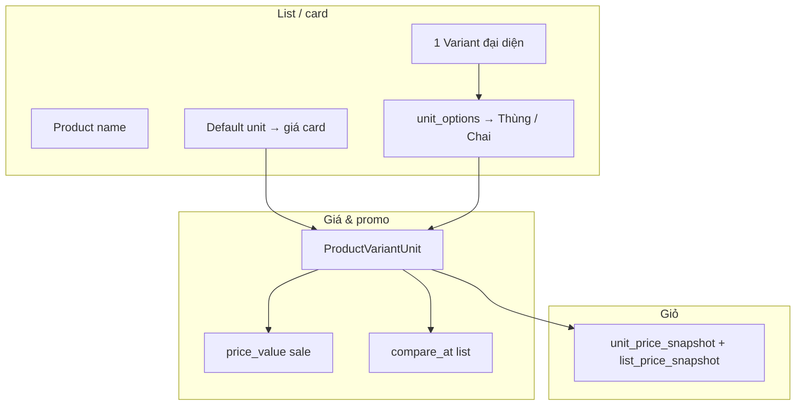

# Store catalog — product strategy (đơn giản)

**Đối tượng:** PM, FE, BE, ops seed promo.  
**Liên quan:** [`product-pricing-promotions.md`](product-pricing-promotions.md) (giá & promo), plan `catalog-pricing-direct-discount-refactor`.

---

## 1. Ba tầng — nhớ một câu

> **Product = tên SP · Variant = quy cách · Unit = đơn vị bán + giá**

| Tầng | Model BE | Ví dụ | Dùng để |
|------|----------|-------|---------|
| **Product** | `Product` | Cồn 70° Vĩnh Phúc 1000ml | Tên, slug, brand, campaign scope (`mid`) |
| **Variant** | `ProductVariant` | Một SKU / một quy cách đóng gói | Ảnh, tồn, ranking |
| **Sale unit** | `ProductVariantUnit` | **Thùng**, **Chai**, Hộp, Vỉ | **`price_value`, promo, giỏ, checkout** |

**Promo catalog (giảm giá trực tiếp):** luôn trên **sale unit** — mỗi unit có list/sale riêng.  
**Voucher đơn:** mã giảm trên tổng đơn — tách lớp, không thay giá unit.

---

## 2. List / card hiển thị thế nào?

Trên search, category, hot-sale rail:

```text
1 dòng API  =  1 ProductVariant  (sau dedupe: 1 variant / 1 Product)
Card UI     =  mặt Product (tên, link) + giá từ default unit + nút đổi unit
Giỏ hàng    =  variant_id + unit_id đang chọn
```

| UI thấy | Thực chất BE |
|---------|----------------|
| Một card “sản phẩm” | **Product** (tên) + **1 variant đại diện** |
| Giá + badge −% | **Default `ProductVariantUnit`** |
| Nút Thùng / Chai | Các **unit** cùng variant |
| `variant_count > 1` | Product có **nhiều variant** (PDP chọn quy cách khác) |

Helper: `storeApp/services/variant_listing.py` → `one_variant_per_product` (list không trùng Product).

---

## 3. Quy tắc promo (thị trường / dược)

1. **Cùng tier %** có thể áp cho **mọi unit published** trên variant (vd. hot-sale −30%: Thùng và Chai đều −30% trên giá gốc **của từng unit**).
2. **Không** gán `compare_at` của unit A lên giá unit B (FE chỉ gạch giá unit đang chọn).
3. **Giỏ** snapshot giá lúc add / đổi unit — không gửi % từ FE.
4. Hết hạn promo → cron `run_campaign_scheduler` revert catalog (giữ snapshot `ProductUnitPromotion`).

Hot-sale seed: `python manage.py seed_hot_sale_campaign` — campaign `san-pham-ban-chay`, 12 SP popular.

### 3.1 Campaign × SKU — bao nhiêu campaign cùng lúc?

SoT chi tiết: [`product-pricing-promotions.md`](product-pricing-promotions.md) **D-PRC-06**.

| Rule | Ý nghĩa ngắn |
|------|----------------|
| **P1 — Pricing exclusivity** | Mỗi **sale unit** tối đa **1** promo giá catalog effective (`price_value` + `compare_at` từ `ProductUnitPromotion`). |
| **M1 — Merch non-exclusive** | Cùng SKU có thể nằm **nhiều** campaign **trưng bày** (flash slot, hot rail, landing) — **không** đổi giá thêm. |
| **V1 — Voucher** | Nhiều campaign publish voucher; giỏ áp **một** mã / scope qua `voucher_engine`. |
| **UX1 — Hiển thị** | Card / PDP / giỏ = giá API; flash upcoming chỉ **mask** (`-xx%`, `xxx.nnnđ`), không tạo giá thứ hai. |

**Case hay gặp (Long Châu-style):** tab flash *“Sắp diễn ra”* nhưng PDP đã **−20%** → promo **pricing (P1)** đã chạy; tab flash chỉ là **merch slot (M1)** chưa mở — không nhất thiếu là bug.

**Overlap pricing (ops):** tránh gán hai campaign cùng hạ giá một unit; BE P1b nếu lỡ overlap → `campaign.priority` quyết định giá effective.

---

## 4. Sơ đồ nhanh



---

## 5. Manual test nhanh (sau seed)

| # | Case | Pass |
|---|------|------|
| C1 | Card multi-unit: Thùng ↔ Chai | Mỗi unit: sale + gạch đúng tier % |
| C2 | Giỏ line promo | Dưới giá sale có dòng gạch list |
| C3 | Đổi unit trên giỏ | Giá + gạch + direct savings đổi theo unit |
| C4 | `/don-hang` | Line SP có gạch như giỏ |

**Docker re-seed:**

```bash
docker exec clinic-oupharmacy-be-backend-1 python manage.py seed_hot_sale_campaign --revert-promo
docker exec clinic-oupharmacy-be-backend-1 python manage.py seed_hot_sale_campaign
```

Sau đổi code BE (multi-unit promo): **rebuild image** rồi chạy lại hai lệnh trên.

---

## 6. File code hay đụng

| Việc | Path |
|------|------|
| Model | `storeApp/models/product.py` |
| List dedupe | `storeApp/services/variant_listing.py` |
| API list | `storeApp/serializers.py` → `ProductVariantSerializer` |
| Hot-sale seed | `storeApp/services/hot_sale_campaign.py` |
| Promo lifecycle | `storeApp/services/product_promotion.py` |
| FE card | `oupharmacy-store/.../ProductCard.tsx`, `products.ts` |
