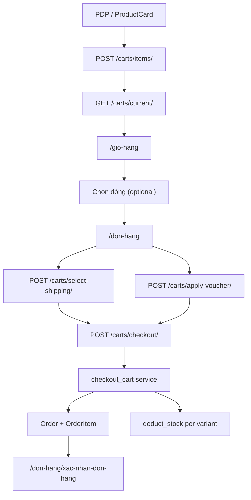
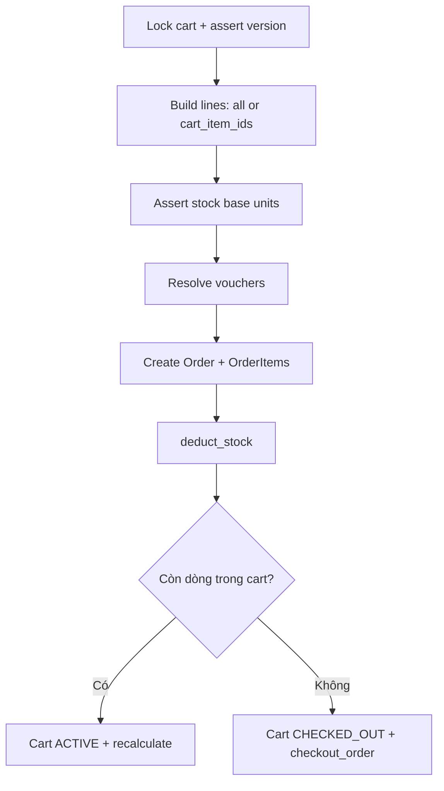

# Cart-first checkout — guideline

Tài liệu chuẩn cho luồng **giỏ hàng → đặt hàng** (Store API + `oupharmacy-store`).  
Source of truth code: `storeApp/services/cart_service.py`, `storeApp/viewsets/cart.py`, FE `src/lib/services/carts.ts`, `src/contexts/CartContext.tsx`, `src/app/don-hang/page.tsx`.

> Cập nhật: 2026-05. Khi đổi contract checkout, sửa file này cùng lúc với view/serializer.

---

## 1. Trạng thái triển khai (snapshot)

| Hạng mục | Trạng thái | Ghi chú |
|----------|------------|---------|
| Cart-first API (`/carts/*`) | **Live** | `CartViewSet`, `IsAuthenticated` |
| Optimistic lock `expected_version` | **Live** | Mutate + checkout; `409` khi stale |
| Pricing / voucher trên cart | **Live** | 2 slot: `order_voucher`, `shipping_voucher` |
| Checkout `delivery` (orderer / recipient / address) | **Live** | `checkout_delivery.py` → `Order.shipping_address` |
| Partial checkout `cart_item_ids` | **Live** | BE + FE `/don-hang`; cart có thể còn ACTIVE |
| Đổi đơn vị bán (PATCH `product_variant_unit_id`) | **BE live** | FE giỏ hàng: plan mở (`cart-packaging-switch`) |
| Guest checkout (không login) | **Chưa** | Guest = `localStorage` only; plan `guest-checkout-cart-first` |
| Legacy `POST /orders/` | **Compat** | Nhánh `cart_id`; ưu tiên `carts/checkout` |
| Cart cache | **Noop** | `CartCacheGateway`; có thể Redis sau |

**Catalog (ảnh hưởng stock checkout)** — sau re-import (tham chiếu audit):

| Metric | Giá trị |
|--------|---------|
| Products | ~6936 |
| Variants | ~6944 |
| VariantUnits | ~8377 |
| Units `price_value` ≤ 0 | 0 |
| Variants thiếu default unit | 0 |

Stock checkout: `MedicineBatch.remaining_quantity` (base unit) → `deduct_stock`; `ProductVariant.in_stock` là cache (nên sync nếu lệch).

---

## 2. Sơ đồ luồng

### 2.1 User đã đăng nhập (luồng chính)



### 2.2 Khách chưa đăng nhập (hiện tại)


Sau login: `CartContext` merge localStorage → server (`getCurrentCart` + `POST /carts/items/`).

### 2.3 `checkout_cart` (BE, tóm tắt)



---

## 3. Mô hình dữ liệu (liên quan checkout)

```
User ──1 ACTIVE── Cart ──< CartItem >── ProductVariant
                              │              └── ProductVariantUnit (unit_price_snapshot)
                              ├── shipping_method
                              ├── order_voucher / shipping_voucher
                              └── checkout_order → Order (partial hoặc full)
```

| Model / field | Vai trò checkout |
|---------------|------------------|
| `Cart.version` | Optimistic locking |
| `CartItem.product_variant_unit` | Đơn vị bán; snapshot giá |
| `CartItem.unit_price_snapshot` | Giá tại thời điểm thêm/cập nhật |
| `CartItem.quantity` | Số đơn vị bán (Hộp/Vỉ/…) |
| `ProductVariantUnit.quantity_in_base` | Quy đổi sang base unit khi trừ tồn |
| `Product.mid` | Voucher `applicable_products` |
| `Product.category` | Voucher `applicable_categories` (1 category / product hiện tại) |

Constraint: unique `(cart, product_variant, product_variant_unit)` — đổi unit phải PATCH hoặc merge dòng (xem plan packaging).

---

## 4. API contract

Base path: `/api/store/carts/` (alias DB `store`).

### 4.1 Endpoints

| Method | Path | `expected_version` | Mô tả |
|--------|------|------------------|--------|
| GET | `current/` | — | Cart ACTIVE + `version` + totals |
| POST | `items/` | ✓ | Thêm/cập nhật dòng |
| PATCH | `items/{id}/` | ✓ | `quantity` và/hoặc `product_variant_unit_id` |
| DELETE | `items/{id}/` | ✓ (query) | Xóa dòng |
| POST | `select-shipping/` | ✓ | Gán `shipping_method` |
| POST | `apply-voucher/` | ✓ | Mã order / shipping |
| POST | `remove-voucher/` | ✓ | Gỡ voucher |
| POST | `recalculate/` | ✓ | Tính lại subtotal/total |
| POST | `checkout/` | ✓ | Tạo `Order` |

### 4.2 `POST /carts/checkout/`

**Bắt buộc:** `expected_version`, `payment_method_id`, địa chỉ (`shipping_address` **hoặc** `delivery`).

**Khuyến nghị — `delivery`:**

```json
{
  "expected_version": 3,
  "payment_method_id": 1,
  "notes": "optional",
  "cart_item_ids": [12, 15],
  "delivery": {
    "orderer": { "name": "...", "phone": "...", "email": "..." },
    "recipient": { "name": "...", "phone": "..." },
    "address": {
      "province": "...",
      "district": "...",
      "ward": "...",
      "detail": "số nhà, đường"
    }
  }
}
```

- `cart_item_ids`: optional; chỉ thanh toán subset; cart **giữ ACTIVE** nếu còn dòng.
- Legacy `shipping_address` string: vẫn nhận; nếu cả hai có thì string không rỗng **ưu tiên**.
- Lỗi validate: `400` + `{ "error", "details" }`.
- Version sai: `409` + `expected_version` / `current_version`.

### 4.3 Concurrency (`409`)

1. `GET /carts/current/`  
2. Cập nhật UI (`version`, lines, totals)  
3. Retry mutate với `expected_version` mới — không spam version cũ.

---

## 5. Frontend map (`oupharmacy-store`)

| Thành phần | File | Vai trò |
|------------|------|---------|
| API client | `src/lib/services/carts.ts` | Types + `checkoutCart`, mutations |
| Delivery body | `src/lib/validations/checkout.ts` | `buildCheckoutDeliveryPayload` |
| Giỏ | `src/contexts/CartContext.tsx` | Server cart khi auth; localStorage guest |
| Checkout state | `src/contexts/CheckoutContext.tsx` | Form, `checkoutScopedLineIds` |
| Trang thanh toán | `src/app/don-hang/page.tsx` | Shipping, voucher, `checkout` |
| Xác nhận | `src/app/don-hang/xac-nhan-don-hang/page.tsx` | Sau order |
| Giỏ hàng | `src/app/gio-hang/page.tsx` | Chọn dòng → scope checkout |

**Luồng FE đã login:**

1. `useCurrentCart` → `version`, items, vouchers.  
2. `/don-hang`: `selectShipping` + `applyVoucher` với `expected_version`.  
3. `checkoutCart({ delivery, payment_method_id, expected_version, cart_item_ids? })`.  
4. Redirect xác nhận với `order_number` / `order_id`.

---

## 6. Backend map

| Thành phần | File |
|------------|------|
| HTTP | `storeApp/viewsets/cart.py` |
| Nghiệp vụ | `storeApp/services/cart_service.py` |
| Địa chỉ | `storeApp/services/checkout_delivery.py` |
| Voucher | `storeApp/services/voucher_engine.py`, `storeApp/models/voucher.py` |
| Trừ tồn | `storeApp/services/stock.py` (gọi từ `checkout_cart`) |
| Legacy order | `storeApp/viewsets/order.py` (`cart_id` → `checkout_cart`) |
| Models | `storeApp/models/cart.py`, `order.py`, `product.py` |

---

## 7. Quy tắc nghiệp vụ (cần nhớ)

| # | Rule |
|---|------|
| 1 | Một user chỉ một cart `ACTIVE` (`store_cart_one_active_per_user`). |
| 2 | Checkout cần `shipping_method` trên cart. |
| 3 | Giá trên order = `CartItem.unit_price_snapshot` (không tự lấy giá live khi checkout). |
| 4 | Tồn kho: tổng `quantity × quantity_in_base` theo variant; so với batch còn lại. |
| 5 | Voucher: validate theo `subtotal`, `product_mids`, `category_slugs` tại thời điểm checkout. |
| 6 | Partial checkout: chỉ xóa dòng đã thanh toán; recalculate cart còn lại. |

---

## 8. Gap & plans liên quan

| Gap | Plan (workspace) |
|-----|------------------|
| Guest không checkout server | `.cursor/plans/[Urgent][UnDone] guest-checkout-cart-first.plan.md` |
| Đổi unit trên UI giỏ | `plans/[UnDone] cart-packaging-switch-full-workflow.plan.md` |
| Một product nhiều category (voucher/list) | `plans/[UnDone] product-multi-category-m2m.plan.md` |

**Done (checkout):** `plans/[Done] store-checkout-be-recipient-address.plan.md` — payload `delivery`.

---

## 9. Tương thích legacy

- `POST /api/store/orders/` + `cart_id`: gọi cùng `checkout_cart` (header `X-Checkout-Flow: cart`).
- Raw items trên `orders.create`: legacy; không dùng cho feature mới.
- Response deprecation header gợi ý dùng `carts/checkout`.

---

## 10. Checklist verify

### API (authenticated)

- [ ] `GET /carts/current/` → `version`, `items[]`, totals.  
- [ ] `POST /carts/items/` với đúng `expected_version`.  
- [ ] `PATCH` đổi `quantity` / `product_variant_unit_id`.  
- [ ] `409` khi gửi version cũ; retry sau `GET current`.  
- [ ] `POST /carts/checkout/` với `delivery` → order + stock giảm.  
- [ ] Partial: `cart_item_ids` → order subset, cart còn dòng thì vẫn ACTIVE.  
- [ ] Voucher order + shipping áp dụng đúng scope.

### FE E2E (manual)

- [ ] Login → thêm SP → `/gio-hang` → `/don-hang` → đặt hàng → trang xác nhận.  
- [ ] Chọn subset dòng → checkout chỉ subset.  
- [ ] Guest: giỏ local; sau login merge lên server.

### Ops

- [ ] `python manage.py store_catalog audit --overview` — units price > 0, default unit OK.  
- [ ] Spot-check `in_stock` vs batch nếu báo hết hàng sai.

---

## 11. Liên kết

- `storeApp/guidelines/models-overview.md` — Product / Variant / PVU / batch.  
- `plans/[UnDone] cart-packaging-switch-full-workflow.plan.md`  
- `plans/[UnDone] product-multi-category-m2m.plan.md`
