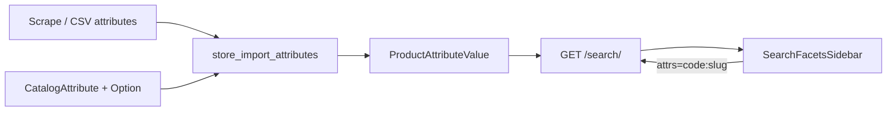

# Catalog attributes — model & feature

> SoT cho **bộ lọc nâng cao theo thuộc tính sản phẩm** (đối tượng, loại da, dạng bào chế…).  
> Không nhầm với catalog hàng hóa (`Product` / `Category` / `Brand`).

## Mục đích

Từ điển thuộc tính lọc + gán giá trị lên `Product`, để:

1. `/search/` aggregate `facets.attributes[]` theo **distinct product** trong kết quả hiện tại  
2. Filter repeatable `attrs=code:slug` (AND giữa code, OR trong cùng code)  
3. FE sidebar map động — **không** hardcode list audience/flavor

Brand / category / giá / tồn / nước sản xuất (`Brand.country`) **không** nằm trong schema này.

## Model (`storeApp/models/catalog_attributes.py`)

```
CatalogAttribute 1──* CatalogAttributeOption 1──* ProductAttributeValue *──1 Product
```

| Model | Table | Vai trò |
|-------|--------|---------|
| `CatalogAttribute` | `store_catalog_attribute` | Định nghĩa nhóm facet (`code`, `label`, `facet_type`, `sort_order`, `is_filterable`) |
| `CatalogAttributeOption` | `store_catalog_attribute_option` | Option trong nhóm; unique `(attribute, slug)` |
| `ProductAttributeValue` | `store_product_attribute_value` | Gán option ↔ **Product** (không Variant); unique `(product, option)` |

### Dictionary v1 (seed)

`manage.py seed_catalog_attributes` — idempotent:

| `code` | Label (VI) | Nguồn scrape điển hình |
|--------|------------|-------------------------|
| `target_user` | Đối tượng sử dụng | `objectUse` |
| `skin_type` | Loại da | `skin` |
| `flavor` | Mùi vị / hương | `flavor` |
| `indication` | Chỉ định | `indications` |
| `dosage_form` | Dạng bào chế | `dosageForm` |
| `brand_origin` | Xuất xứ thương hiệu | `brandOrigin` |

Map nguồn → store: `storeApp/services/catalog_attribute_map.py`  
(`manufactor` / `brand` / `category` / price → **skip** attr; country → `Brand.country`).

### Migration

- `0012_catalog_attributes.py`

## Feature flow



1. **Seed** dictionary (một lần / môi trường).  
2. **Import** attrs từ scrape row (`attributes` JSON hoặc flat PDP fields) → get_or_create option + PAV (additive).  
3. **Search** `SearchFacetsService.build_attribute_facets` — chỉ group có count > 0 trong queryset hiện tại.  
4. **FE** `mapSearchFacetsToFilterGroups` → `facetSearchParams.collectAttrFacetParams` → repeatable `attrs`.

## API (rút gọn)

Chi tiết đầy đủ: [`search-faceted-api.md`](search-faceted-api.md).

**Query:** `attrs=dosage_form:gel&attrs=target_user:tre-em`  
**Facet item:**

```json
{
  "code": "dosage_form",
  "label": "Dạng bào chế",
  "type": "multiple",
  "options": [{ "slug": "gel", "label": "Gel", "count": 12 }]
}
```

## FE (oupharmacy-store)

| File | Vai trò |
|------|---------|
| `src/lib/services/search.ts` | Types `attributes[]`; append repeatable `attrs` |
| `src/lib/listing/facetSearchParams.ts` | `collectAttrFacetParams` / `pickFacetSearchParams` |
| `useStorePage.ts`, `tim-kiem/page.tsx` | Forward `attrs` vào search |
| `SearchFacetsSidebar` / `ActiveFilters` | UI chung; label từ API groups |

Không dùng `PRODUCT_FILTERS.TARGET_AUDIENCES` / `FLAVORS` (đã gỡ).

## Ops / data

```bash
# Dictionary
python manage.py seed_catalog_attributes

# Attrs khi import catalog CSV/JSON (hook trong store_import_csv)
python manage.py store_catalog import-csv <path>

# Offline pilot CSV (local only — không commit): local_scrape/tools/import_attrs_csv.py
```

Invalidate facet cache: `SearchFacetsService.invalidate_all_cache()` (sau import / backfill).

### Coverage (quan trọng)

Facet `attributes` **chỉ** đếm SP đã có `ProductAttributeValue`.  
Nếu listing có hàng trăm SP nhưng mới import attrs cho một phần → sidebar chỉ hiện vài option / count nhỏ — **đúng theo data PAV**, không phải lỗi aggregation.  

`origin_country` (Nước sản xuất) lấy từ `Brand.country` nên thường đầy hơn nhiều so với các nhóm attr.

## Non-goals

- Không CategoryFacetConfig theo slug  
- Không Elasticsearch ở phase này  
- Không gắn attr ở **Variant** (product-level only)  
- Không dùng `Product.specifications` / `content.usage` làm SoT facet  

## Docs liên quan

- Models overview: `storeApp/models/__overview.md`  
- Search API: `storeApp/guidelines/search-faceted-api.md`  
- Import: `storeApp/management/commands/catalog_import/README.md`  
- Spike nguồn scrape: `storeApp/guidelines/catalog-attributes-scrape-spike.md`  
- FE routing: `oupharmacy-store/docs/ROUTING.md`
